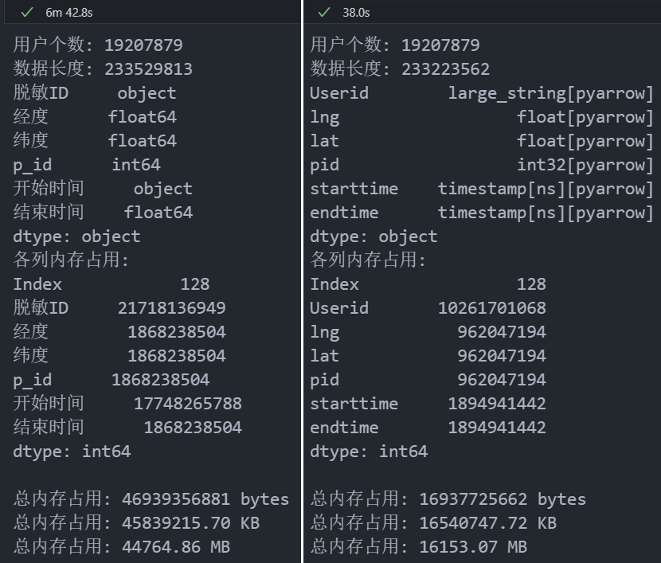
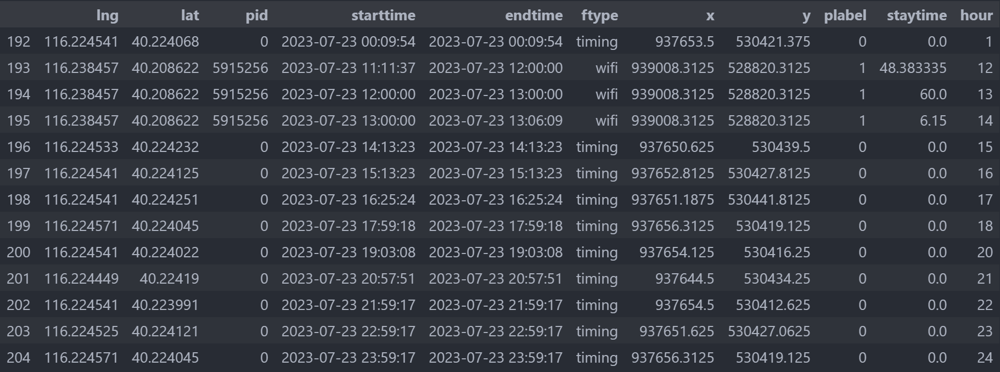
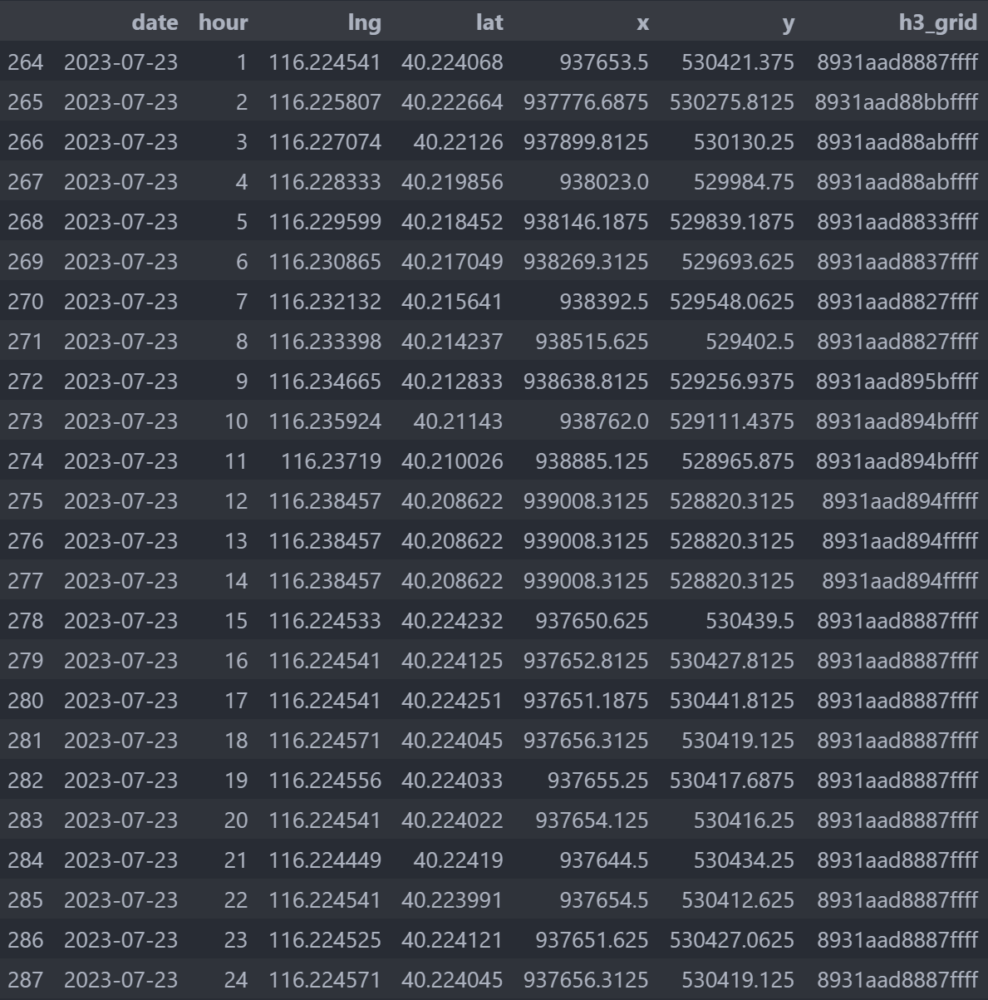

# 手机SDK数据说明文档

更新于2026.07.13


## 原始数据

### 数据介绍

此部分和黄胜师兄处理流程和命名规则保持一致。

**手机SDK数据**是基于手机App内嵌的第三方**SDK（Software Development Kit，软件开发工具包）**在运行时从手机上采集并上报的部分数据，一般会在**App隐私政策**中声明采集内容。

这部分SDK为了完成开发者想实现的相关功能或做数据分析，一般会采集例如**设备硬件信息、品牌和型号信息、网络信息、位置信息、应用信息、传感器信息、行为与诊断数据**等。

对于目前所掌握的SDK数据，大概率是基于**LBS/广告/场景感知类SDK**（如高德、百度LBS SDK等），基于**Wifi、基站、传感器、GPS等信息**进行**地理围栏与POI场景匹配**获得。

手机SDK数据分为四个类型，分别为**Wificonnect（WiFi连接）**、**Wifistable（WiFi稳定）**、**Timing（定时点位）**、**Scenerco（场景识别）**，其中场景识别、WiFi连接、WiFi稳定三类数据与poi相关（具有pid字段），定时点位是围栏相关没有poi。


数据的具体说明如下：

| 类型                                    | 触发条件                           | 精度    | 来源                                                         | 用途                     |
| --------------------------------------- | ---------------------------------- | ------- | ------------------------------------------------------------ | ------------------------ |
| WiFi连接点位数据<br>（**Wificonnect**） | 用户连接WiFi时                     | 15-20米 | 商场/商业体内的WiFi热点<br>WiFi连接过，就会归属到WiFi连接点位的数据 | 场景识别                 |
| WiFi稳定点位数据<br>（**Wifistable**）  | 停留2分钟以上                      | 2-3米   | 手机与WiFi AP的持续交互                                      | 高精度稳定驻留点识别     |
| 定时点位数据<br>（**Timing**）          | 有固定时间停留（即使没有WiFi交互） | 30-50米 | 手机定位数据的时间序列分析                                   | 基于时间规则判断的停留点 |
| 场景点位数据 <br>（**Scenerco**）       | 场景触发（POI级）                  | 2-3米   | 通过定位、wifi、蓝牙AP信息以及设备地磁、气压计、陀螺仪等多类环境信号，与云端服务器场景数据库比对，识别POI级场景 | 场景识别                 |


### data_v0

**原始的zip压缩包数据**

- 北京市：2023年7月-2024年3月，共275天，总计3.42TB

- 天津市：2023年7月-2023年12月，共184天，总计1.61TB

- 河北省：2023年7月-2023年12月，共184天，总计4.62TB
- 厦门市：2022年7约-2024年6月，共731天，总计5.51TB
- （待补充）


### data_v1

**原始zip文件解压后的csv数据（解压到独立的文件夹）**

- 解压缩后的文件约为原始文件的2倍
- 在处理步骤中这一步可以忽略，直接得到data_v2数据


### data_v2

**解压后的csv文件根据文件和目录名分别移动到对应的目录结构下的数据**

子目录包括**SceneReco、Timing、WifiConnect、WifiStable**（下同），格式为：

```xml
F:/data_v2/北京市/
  ├── SceneReco/
  │  ├── 2023-07-01.csv
  │  ├── ……
  │  └── 2024-03-31.csv
  ├── Timing/
  ├── WifiConnect/
  └── WifiStable/
```


## 数据处理思路及步骤

此部分主要在黄胜师兄的代码基础上，徐睿进行了代码优化与函数封装，显著提高了处理速度并使得整个流程流水线化。


### 主要思路

以**Timing**为主要数据，使用**WifiStable**和**SceneReco**对**Timing**数据进行插值得到新的更丰富的序列，处理过程中主要负责解决**时空重叠、冲突与异常**。


### 目标数据集

- **面向用户（当前开展）**：提取持续观测且具备稳定住址用户，清洗合及筛选数据集之后，计算人群移动行为指数得到面板数据进行分析。
- **面向场所（待开展）**：基于该数据具有丰富的场景属性，可以选定研究区域并划定研究单元，提取各单元多类型数据合并处理、汇 总，得到特定时空粒度的时间序列数据。

#### data_v3

数据压缩、合并与去重

#### data_v4

##### merge_v0

##### merge_v1

##### merge_v1a

##### merge_v2a

##### merge_v2b


### 处理流程

1. 初始数据解压及格式转换（data_v2）

2. 数据压缩、合并与去重（data_v3）

3. 时间范围及持续观测用户筛选、切分（common_user）

4. 按照拆分后的用户切分和过滤原始数据集，得到逐日用户组文件（data_v4：Merge_v0）

5. 数据清洗及异常处理（data_v4：Merge_v1）（慢）

6. 数据融合及插值（data_v4：Merge_v2）

7. 用户职住地址计算：基于选定时间段内的夜间位置计算稳定住址（user_home）

8. 稳定住址用户筛选（前10天内工作日有8天的住址位于稳定住址附近200m）（data_v5）

   可连接人口统计数据计算数据空间代表性

9. 天尺度逐用户移动指标计算：包括出行距离、回旋半径等（data_v6）

10. 小时尺度逐用户移动指标计算：包含位移、所属场所功能区等（data_v7）

11. 融合数据产品：格网级别的逐小时移动指标汇总（待完成）


### 数据处理情况

- 北京市：2023年7月-2024年3月，已处理到data_v5
- 天津市：2023年7月-2023年12月，已处理到data_v3
- 河北省：2023年7月-2023年12月，已处理到data_v3
- 厦门市：2022年7约-2024年6月，已处理到data_v4：Merge_v1


## 数据处理代码

初始环境：见 `env/Requirements.txt`


### 1、s1_csv2parquet.py

**功能：将原始的解压文件（data_v2）转换为排序好的parquet文件（data_v3）**

**代码总运行时间：约3天（北京市）**

**介绍：**

- parquet文件以**列为索引**进行存储方便读取，可以只读取部分需要的列，缩短读取时间
- 使用**pyarrow引擎**读取配合**列类型修改**和**parquet无损压缩**使得文件大小降至原先csv文件的**约1/5**
- 北京市/Timing/2023-07-01.parquet：**17.76GB → 3.41GB**
- 这一步转换完成、确认数据无误后可**删除data_v2数据**以节省空间

> [!NOTE]
>
> @hs: 以下目录结构和大致处理说明，所有文件格式均采用Arrow列存储[二进制]文件**parquet**或**feather**，前者读写速度快且文件较小，后者读写更快文件略增大。此类文件可大幅减少存储及读写成本，对比见：
>
> [参考]: https://hscyber.github.io/posts/7188d134/
>
> 

**首先仅按用户id进行排序**：

|  |
| ------------------------------- |
|  |

```xml
输入：data_v2
输出：data_v3

输入目录结构要求：
F:/data_v2/北京市/
  ├── SceneReco/
  │  ├── 2024-01-01.csv 
  │  └── 2024-01-02.parquet
  ├── Timing/
  ├── WifiConnect/
  └── WifiStable/

输出目录结构：
F:/data_v3/北京市/
  ├── SceneReco/
  │  ├── 2024-01-01.parquet
  │  └── 2024-01-02.parquet
  ├── Timing/
  ├── WifiConnect/
  └── WifiStable/
```

读取文件时采用 **PyArrow引擎和数据类型**：

```python
# 读取文件（支持CSV、XLS和Parquet）
if file_path.suffix.lower() == ".csv":
    df = pd.read_csv(file_path, engine="pyarrow", dtype_backend="pyarrow")
    # 注意有些原始csv文件有脏行，即数据保存时没有对齐，此时不能使用pyarrow引擎
    # df = pd.read_csv(file_path, engine='python', dtype_backend="pyarrow", on_bad_lines="skip")
elif file_path.suffix.lower() in (".xls", ".xlsx"):  # 包括xls，用pyarrow引擎
    df = pd.read_excel(file_path, dtype_backend="pyarrow")
else:  # 包括.parquet，用pyarrow引擎
    df = pd.read_parquet(file_path, engine="pyarrow", dtype_backend="pyarrow")
```

数据差异：

有关

**数据类型转换**

- **object类型**的 UserID 转为 **PyArrow 字符串**可以有效减少字符串寻址开销

- 由于原始数据中，经纬度是用**双精度浮点数（double，64位）**存储，每一条记录占8个字节，若转为**单精度浮点数（float，32位）**存储，能节省一半的存储空间
- **精度损失：**单精度浮点数有效数字约7位，在表达经纬度数据时有效到小数点后4-5位（1-10m左右误差），和定位误差在一个数量级，可以接受
- 时间戳转换为**1970-01-01 00:00:00之后的纳秒数**，用64位整型存储

```python
# 转换类型，减少内存占用，加速后续的去重和排序
df["Userid"] = df["Userid"].astype("string[pyarrow]")  # ID 转为 PyArrow 字符串
df["lng"] = df["lng"].astype("float32[pyarrow]")  # 经纬度转 float32
df["lat"] = df["lat"].astype("float32[pyarrow]")
df["pid"] = df["pid"].fillna(-1).astype("int32[pyarrow]")  # pid 转 int32
time_fmt = "%Y-%m-%d %H:%M:%S"
df["starttime"] = pd.to_datetime(df["starttime"], format=time_fmt, errors="coerce")  # 时间戳转换
df["endtime"] = pd.to_datetime(df["endtime"], format=time_fmt, errors="coerce")
```

保存文件时采用**zstd压缩**方式，在保持读写速度的同时增大压缩比率：

```python
# 处理数据：排序，去重
df.drop_duplicates(subset=["Userid", "starttime", "endtime"], inplace=True)
df.sort_values("Userid", kind="mergesort", inplace=True)
# 保存为Parquet，默认压缩方式为snappy，这里采用压缩效率更高的zstd
df.to_parquet(output_file, engine="pyarrow", compression='zstd', index=False)
```

处理后文件**读取时间减少90%，内存占用减少64%**：




### 1.5、s1_users_count.py

**功能：基于排序好的parquet文件（data_v3）统计输出用户信息**

- **共同用户表** CUsers.feather（指定时间段内长期观测用户id文件）
- **全部用户表** Users.feather（指定时间段内全部用户id文件）

**代码总运行时间：约1天（北京市）**

**介绍：**

- 依次读取每一天的SceneReco、Timing、WifiConnect和WifiStable文件，生成对应的用户数量信息，同时保存每天的用户id
- 生成一个**用户活跃天数统计表 `user_active_distribution.csv`** 和**逐日用户数量统计表 `daily_user_counts.csv`**，方便对比分析筛选长期观测用户的阈值

```xml
输入：data_v3
输出：data_v3

输入目录结构要求：
F:/data_v3/北京市/
    ├── SceneReco/
    │   ├── 2024-01-01.parquet
    │   └── 2024-01-02.parquet
    ├── Timing/
    ├── WifiConnect/
    └── WifiStable/

输出目录结构：
F:/data_v3/北京市/
    ├── daily_users/
    │   ├── 2024-01-01.feather
    │   └── 2024-01-02.feather
    ├── SceneReco/
    │   ├── 2024-01-01.parquet
    │   └── 2024-01-02.parquet
    ├── Timing/
    ├── WifiConnect/
    ├── WifiStable/
    ├── CUsers.feather (长期观测用户id文件)
    ├── Users.feather (全部用户id文件)
    └── user_active_days.feather (用户活跃天数文件)
```

**部分统计结果：**

| 城市   | 日均活跃用户 | 累计用户   | 长期稳定用户 |
| ------ | ------------ | ---------- | ------------ |
| 北京市 | 20,136,383   | 35,521,077 | 7,867,700    |
| 天津市 | 15,364,558   | 19,447,429 | 5,765,490    |
| 河北省 | 47,396,483   | 63,533,239 | 16,809,579   |

上述长期稳定用户指**2023年下半年184天均有连续记录**的用户

由于2024年数据用户和2023年差异较大，在后续处理中，北京市用户更改筛选规则：在2023年7月至2024年3月有184天及以上的记录都纳为长期稳定用户，共计**14,235,788人**

后续考虑处理标准：**连续3个月/6个月**有**45天/90天以上**打点记录的用户都列为长期稳定用户


### 2、s2_track_split.py

**功能：根据拆分后的用户将同一天该用户组的轨迹放在一个文件内**

**代码总运行时间：约2天（北京市）**

**介绍：**

- 根据共同用户表，生成**等距打断后的用户列表**（如北京为每20万人一组）

- 依次读取每一天的SceneReco、Timing、WifiConnect和WifiStable文件，筛选长期稳定用户

- 合并到一个文件中，再依次按用户组拆分，**根据用户id和开始时间排序**


**优点：**

- 减小单个文件体积，方便后续读取与处理

- **同一用户id**只会出现在**固定的组别内**，方便计算常住地等信息

**数据Merge_v0：**按照拆分后的用户列表过滤原始数据集，得到逐日逐用户文件 {date}/group_{i}.parquet

```xml
输入：data_v3
输出：data_v4/Merge_v0

输入目录结构要求：
F:/data_v3/北京市/
    ├── daily_users/
    │   ├── 2024-01-01.feather
    │   └── 2024-01-02.feather
    ├── SceneReco/
    │   ├── 2024-01-01.parquet
    │   └── 2024-01-02.parquet
    ├── Timing/
    ├── WifiConnect/
    ├── WifiStable/
    ├── CUsers.feather
    ├── Users.feather
    └── user_active_days.feather
    
输出目录结构：
F:/data_v4/北京市/Merge_v0/
    ├── 2024-01-01/
    │   ├── group_0.parquet
    │   ├── group_1.parquet
    │   └── rest.parquet
    ├── 2024-01-02/
    │   └── ...
    └── ...
```


### 3、s3_track_clean.py

**功能：对同一天用户的轨迹点进行聚类、合并，保留最长区间**

**代码总运行时间：约3周（北京市）**该部分为**最耗时**处理步骤

**介绍：**

- 目前Merge_v0的数据还存在wifi、定位多重来源**互相干扰、无法合并**的状态，且timing数据为打点，wifi和scene为时段，不好直接合并
- 为了避免时段和点位写两套处理逻辑，在预处理时将瞬时的 timing 定点赋予一个**极短的默认停留时间**：endtime = starttime + 1分钟
- 基于**DBSCAN**对轨迹点进行聚类，在小范围内默认为同一位置，**合并多重数据源：以wifi、scene为主（高精度），timing为辅（较低精度）**
- 同一位置合并数据**保留最长区间**（如果两条记录互相有时间重叠，则取其并集），**允许5分钟的容差**：如果都在同一聚类区内，前后两条数据相隔不超过5分钟，则合并为同一段数据
- 由于涉及极大量轨迹点分用户聚类，因此非常**耗时耗资源**（聚类为cpu密集型，读写为i/o密集型）

**性能：**8进程并行，平均480s/文件，20w用户；较原始代码提速150%

```xml
输入：data_v4/Merge_v0
输出：data_v4/Merge_v1

输入目录结构要求：
F:/data_v4/北京市/Merge_v0/
    ├── 2024-01-01/
    │   ├── group_0.parquet
    │   ├── group_1.parquet
    │   └── rest.parquet
    ├── 2024-01-02/
    │   └── ...
    └── ...

输出目录结构：
F:/data_v4/北京市/Merge_v1/
    ├── 2024-01-01/
    │   ├── group_0.parquet
    │   └── group_1.parquet
    ├── 2024-01-02/
    │   └── ...
    └── ...
```


### 4、s4_track_merge.py

**功能：将聚类、合并好的轨迹点去除异常点和跳跃点，并进行逐小时插值**

**代码版本：**v3.0（运行效率极致优化）

**代码总运行时间：约一天（北京市）**

#### （1）轨迹逻辑校验

**速度合理性校验：**计算相邻两条记录之间的物理距离和间隔时间，计算移动速度

- **点级**异常：**移动速度大于100m/s** 或 **相邻两记录位移大于50km**
- **远离段**异常：
- 如果出现 地点A → 地点B → 地点A 的快速切换，且 A 与 B 距离较远，通常为基站或WiFi漂移所致，**漂移数据应去除，但如果是正常的跨城市移动，则该数据需要保留。**
- 若偏移当日活动中心100km以上，且持续时间小于4小时，判断为远离段；若进出远离段的速度也大于速度阈值，则将该远离段也纳为异常段
- 点级异常和远离段异常任一条件满足，此条/此段记录就应予以剔除。

**缺失值合理填充**

- **静止状态填充**：如果 `T−1` 小时与 `T+1` 小时处于同一个物理位置（或同一个网格），而 `T` 小时无任何数据，在无法获取其他辅助信息的情况下，可合理假设用户在 `T` 小时也处于该位置并进行填充。
- **运动状态留空**：如果前后小时位置不同且相距较远，中间缺失的小时**标记为 “移动中”**，并进行**经纬度线性插值填充**。


#### （2）多数据源合并

当同一用户在同时间内出现多个数据源的定位记录时，需要根据各数据源的**精度、停留时间及语义确定性**进行优先级排序。

该优先级排序也适用于`s3_track_clean.py`：在时段合并时采用数据优先级最高的数据类型属性保存

**优先级从高到低如下：**

1. **第一优先级：SceneReco（场景识别）：**精度最高（2-3米），直接与场景/POI挂钩，具备明确的语义信息，业务解释性强。
2. **第二优先级：Wifistable（WiFi稳定）：**精度高（2-3米），且有2分钟以上的持续交互，代表了高可信度的实际驻留点。
3. **第三优先级：Wificonnect（WiFi连接）：**精度中等（15-20米），属于瞬间触发事件，可信度略低于持续驻留的 Wifistable。
4. **第四优先级：Timing（定时）：**仅基于时间规则和围栏，无直接的商户级POI信息，主要用于补齐空白时段或大范围位置兜底。

在实际执行中，使用数据类型权重表来评估数据等级：**priority_map = {"wifi": 2, "scene": 3, "timing": 1}**

**针对每个用户（User_ID）在每天（Date）的每小时（Hour），执行以下合并逻辑：权重高者优先；相同权重则停留时长高者优先**

1. **单条数据情况**：若该小时内仅有一种数据源的一条记录，直接保留，作为该小时的代表点。
2. **多条同类型数据情况**：若该小时内有多个同类型的记录（例如两个不同的 Wifistable 点）：选择在当前小时内**停留累计时间最长**的记录。
3. **多条不同类型数据情况**：严格按照 **Scene > Wifi > Timing** 的优先级过滤，保留最高优先级的记录作为该小时的唯一轨迹点。


**Merge_v1a：**包含异常点判定结果


**Merge_v2a：**剔除异常点后按小时整点打断，一个小时可能有多个点



**Merge_v2b：**逐小时插值（同一小时有多条记录按上述规则筛选），一天24个点，同时匹配H3格网



```xml
输入：data_v4/Merge_v1
输出：data_v4/Merge_v1a，Merge_v2a，Merge_v2b

输入目录结构要求：
F:/data_v4/北京市/Merge_v0/
    ├── 2024-01-01/
    │   ├── group_0.parquet
    │   ├── group_1.parquet
    │   └── rest.parquet
    ├── 2024-01-02/
    │   └── ...
    └── ...

输出目录结构：
F:/data_v4/北京市/Merge_v1a/
    ├── 2024-01-01/
    │   ├── group_0.parquet
    │   └── group_1.parquet
    ├── 2024-01-02/
    │   └── ...
    └── ...
```


### 5、s5_user_home.py

**功能：提取用户常住地、工作地并计算基础移动性指标**

**代码总运行时间：约1天（北京市）**

**介绍：**

- **用户常住地**提取标准：考虑每个用户**夜间时段22时-6时**，最常出现的H3网格（**概率超过0.6**且该网格位于**北京市内**）
- **用户工作地**提取标准：考虑每个用户**日间时段10时-18时**，最常出现的H3网格（**概率超过0.4**且该网格位于**北京市内**）
- 北京市使用有6个月完整打点记录的用户，计算得到的用户职住信息：一个用户**一个居住地**、**一个工作地**（可以没有）

```
输入：data_v4/Merge_v2b
输出：data_v5/

输入目录结构要求：
F:/data_v4/北京市/Merge_v2b/
    ├── 2024-01-01/
    │   ├── group_0.parquet
    │   └── group_1.parquet
    ├── 2024-01-02/
    │   └── ...
    └── ...

输出目录结构：
F:/data_v5/北京市/
    ├── 2024-01-01/
    │   ├── group_0.parquet
    │   └── group_1.parquet
    ├── 2024-01-02/
    │   └── ...
    └── ...
```

目前统计2023.07.01-2023.07.31 7月份共31天

- **累计出现用户数：24,306,411**
- **统计公共用户数：14,235,788**
- **提取稳定常住用户数：5,924,981**

H3网格等级：9（边长约170m，面积0.075km2）

数据位置：`data/shape/beijing_h3_set_9.pkl`

提取的用户常住地和工作地信息：


基于夜间（22时-6时）长期停留H3格网，提取2023年下半年184天**约592万**长期居住人口：


